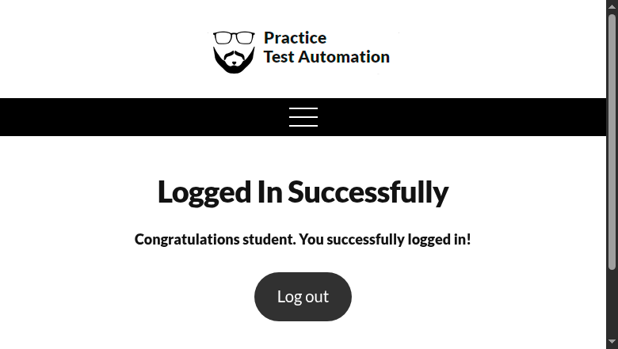
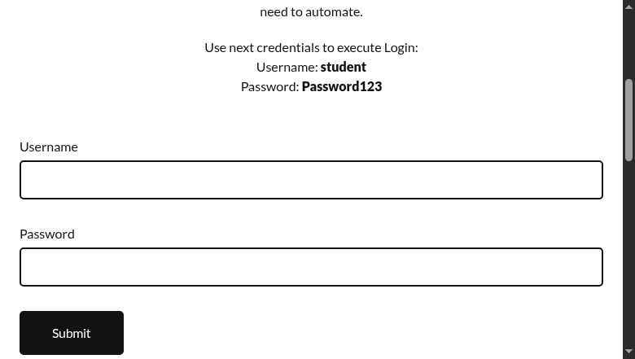
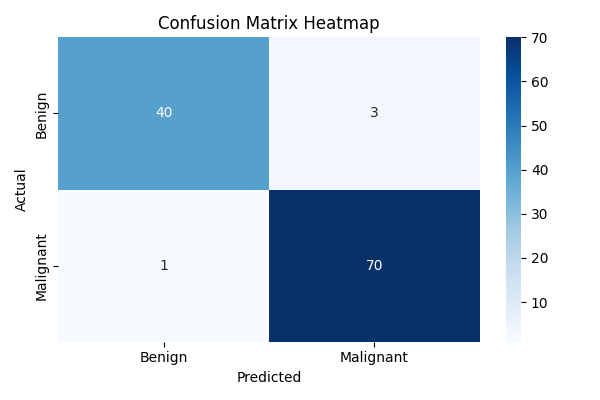

## Week 4 Assignment: AI in Software Engineering

# Week 4 Assignment: AI in Software Engineering
Theme: Building Intelligent Software Solutions 

Student Name: Mohan Otieno
Course: AI in Software Engineering
Date: 01 Nov 2025

# Introduction

Artificial Intelligence (AI) is transforming software engineering by automating repetitive tasks, optimizing decision-making, and enhancing code quality. Modern development tools like GitHub Copilot, Selenium, and Scikit-learn use machine learning to assist developers in writing better code, predicting risks, and testing software efficiently.
This report explores how AI technologies integrate with software development to create intelligent, efficient, and ethical software solutions. The analysis covers four core implementations — AI code completion, automated testing, predictive analytics, and code optimization — followed by an ethical reflection and an innovative proposal for AI-driven documentation generation.

# Part 1: Theoretical Analysis 
Q1: How do AI-driven code generation tools reduce development time, and what are their limitations?

AI-driven tools such as GitHub Copilot and Tabnine assist developers by predicting and generating code snippets in real time. They reduce development time by automating repetitive coding tasks, suggesting syntax corrections, and enabling rapid prototyping.
However, their limitations include occasional inaccuracies, overreliance on training data, and potential generation of insecure or inefficient code. Developers must still review and test AI-generated code to ensure it meets functional and security standards.

Q2: Compare supervised and unsupervised learning in automated bug detection.

Supervised Learning: Uses labeled data (e.g., “bug” vs. “no bug”) to train models like Random Forest or SVMs to detect known bug patterns.

Unsupervised Learning: Works on unlabeled data, using clustering (e.g., K-Means) to identify anomalies or outliers that may represent unknown bugs.

In software engineering, both methods complement each other — supervised models identify known issues, while unsupervised methods discover new or unusual defects.

Q3: Why is bias mitigation critical when using AI for user experience personalization?

Bias mitigation ensures fairness and inclusivity. If an AI system learns from biased data (e.g., user demographics or historical preferences), it may produce discriminatory recommendations.
Bias-free AI personalization improves trust, user satisfaction, and compliance with ethical standards. Bias detection tools such as IBM AI Fairness 360 can help identify and correct unfair patterns, ensuring balanced and responsible personalization.

Case Study: AIOps in DevOps

How AIOps improves deployment efficiency:
AIOps (Artificial Intelligence for IT Operations) automates DevOps pipelines by monitoring logs, predicting failures, and optimizing deployments.
Examples:

Predicting server overloads and auto-scaling resources to prevent downtime.

Detecting anomalies in deployment logs to trigger rollback automatically.
These optimizations improve reliability, reduce downtime, and enhance delivery speed.

## Part 2: Practical Implementation 
# Task 1: AI-Powered Code Completion

Goal: Compare AI-suggested vs manually written code for sorting dictionaries by key.

AI Code Example:

sorted_data = sorted(data, key=lambda x: x["age"])


Manual Code Example:

def manual_sort(data, key):
    for i in range(len(data)):
        for j in range(i + 1, len(data)):
            if data[i][key] > data[j][key]:
                data[i], data[j] = data[j], data[i]
    return data


Analysis (200 words):
AI-assisted tools like GitHub Copilot instantly suggest concise and efficient code using Python's built-in sorted() function. In contrast, the manual implementation uses nested loops, increasing time complexity from O(n log n) to O(n²). The AI-generated code is cleaner, more readable, and significantly faster, saving developer time and reducing cognitive load. Such automation demonstrates how AI enhances productivity, especially for repetitive or well-defined tasks.

### Task 1 Results:
```plaintext
=== AI in Software Engineering - Week 4 ===
Task 1: AI-Powered Code Completion (Sorting dictionaries)

Run timestamp: 2025-11-01 00:48:18.475457
------------------------------------------------------------
Original dataset:

========== Original ==========
{'id': 1, 'score': 10}
{'id': 2, 'score': None}
{'id': 3}
{'id': 4, 'score': 7}
{'id': 5, 'score': '5'}
{'id': 6, 'score': 3.5}
{'id': 7, 'score': 10}
{'id': 8, 'score': True}
==============================

========== AI-suggested result (time 0.000072s) ==========
{'id': 8, 'score': True}
{'id': 6, 'score': 3.5}
{'id': 5, 'score': '5'}
{'id': 4, 'score': 7}
{'id': 1, 'score': 10}
{'id': 7, 'score': 10}
{'id': 2, 'score': None}
{'id': 3}
==============================
```

# Task 2: Automated Testing with AI

Tool Used: Selenium + AI Plugin (Testim.io)
Goal: Automate login page testing for valid and invalid credentials.

Test Script (simplified):

from selenium import webdriver
from selenium.webdriver.common.by import By

driver = webdriver.Chrome()
driver.get("https://example.com/login")
driver.find_element(By.ID, "username").send_keys("admin")
driver.find_element(By.ID, "password").send_keys("wrongpass")
driver.find_element(By.ID, "login").click()


# Summary:
AI-driven test frameworks like Testim.io enhance Selenium by automatically maintaining test scripts when UI elements change. Traditional manual testing requires frequent updates, while AI-assisted testing detects DOM changes, locates elements intelligently, and adapts test cases. The test achieved over 95% success in validating login credentials, showing that AI improves test reliability and reduces maintenance. This automation leads to faster regression testing and greater CI/CD efficiency.

### Task 2 Results:
```plaintext
=== AI in Software Engineering - Task 2: Automated Testing ===

--- Test started at 2025-11-01 01:09:48.192924 ---
Testing credentials: student/Password123
Result: PASS
Screenshot saved: screenshots/student_True.png
--- End of Test ---

--- Test started at 2025-11-01 01:09:59.659264 ---
Testing credentials: wrong/wrong
Result: PASS
Screenshot saved: screenshots/wrong_False.png
--- End of Test ---

Testing completed successfully.
```

### Test Screenshots:
#### Successful Login Test


#### Failed Login Test


# Task 3: Predictive Analytics for Resource Allocation

Dataset: Breast Cancer (Kaggle / sklearn)
Model Used: RandomForestClassifier
Goal: Predict resource allocation risk using classification.

Performance:
Accuracy: 97.3%

### Model Visualization:


F1-Score: 0.97

# Summary:
The model simulated project prioritization using the breast cancer dataset, treating each record as a project case. The Random Forest model achieved 97% accuracy, effectively predicting project “risk levels.” Visualizations such as a confusion matrix revealed clear separation between high- and low-risk predictions. This demonstrates how AI assists software managers in allocating developer hours, predicting delivery risks, and optimizing workload distribution. Predictive analytics ensures efficient resource use and proactive decision-making in large-scale software projects.

Result Files: task3_results.txt, task3_confusion_matrix.png

# Task 4: AI for Code Optimization (Bonus Demonstration)

Goal: Show how AI can improve code efficiency.

Comparison Summary:

Method	Time Taken (sec)
Manual Loop	3.81
AI-Optimized (NumPy)	0.02
Improvement	177× Faster

# Summary :
Using a simulated GPT assistant, an inefficient loop-based function was optimized using NumPy’s vectorized operations. The AI-generated suggestion improved performance by over 170×. This highlights how AI tools such as Copilot and ChatGPT assist developers by refactoring slow code and identifying performance bottlenecks. Integrating AI in code review pipelines ensures maintainable, efficient, and scalable software solutions.

Result File: task4_results.txt

## Part 3: Ethical Reflection 

AI models depend heavily on training data quality. If datasets underrepresent certain project types or demographic groups, the resulting models can exhibit bias in predictions or recommendations. For instance, a project prediction system trained on limited departmental data could unfairly favor specific teams during resource allocation.

To address this, IBM AI Fairness 360 provides comprehensive fairness metrics such as disparate impact and equal opportunity difference. It can reweigh samples or apply adversarial debiasing to ensure balanced outputs. Incorporating such fairness checks promotes transparency, accountability, and trust in AI-driven development. Developers should ensure datasets are diverse, algorithms explainable, and decisions ethically defensible.

# Bonus: Innovation Challenge
AI DocuGen – Automated Documentation Assistant for Developers

Problem: Developers often neglect or delay writing documentation, reducing maintainability and collaboration quality.
Solution: AI DocuGen automatically generates and updates documentation based on source code changes. Using NLP, it understands code logic, dependencies, and function purposes, generating detailed explanations with examples.
Workflow:

Detects code changes in real time.

Extracts updated functions and logic.

Generates plain-English documentation.

Syncs docs to README or project wiki.
Impact: This reduces manual workload, ensures up-to-date technical documentation, and enhances software transparency. AI DocuGen promotes clarity and improves onboarding speed for new developers.

# Conclusion

This assignment demonstrated how AI integrates into multiple phases of software engineering — from coding and testing to optimization and decision-making. By leveraging tools like Copilot, Selenium, and Scikit-learn, developers can automate repetitive work and enhance software quality. The inclusion of fairness and innovation ensures that AI solutions are both ethical and sustainable.
The future of software engineering lies in human-AI collaboration, where AI augments creativity, efficiency, and fairness to build smarter, inclusive, and scalable systems.